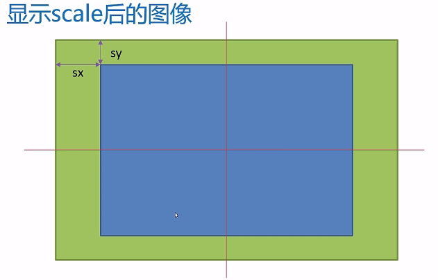
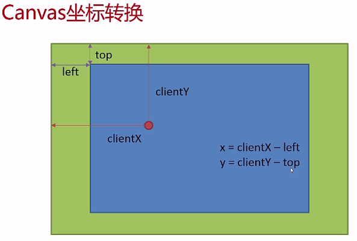
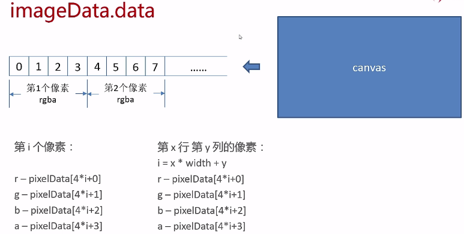

## canvas处理图像

### 图形和图像

> 图形是由外部轮廓线条构成的*矢量图*（svg更擅长绘制矢量图），由计算机绘制的直线、圆、矩形、曲线、图表等。而图像是由扫描仪、摄影机等输入设备捕获实际画面而产生的数字图像，是由点阵构成的*位图*。图形学和图像学实际上是两个不同的学问。

### 图像的缩放

当图像处于放大状态的时候可以采用以下的方法，如下图所示：



```js
function drawImageByScale(scale) {

    var imgWidth = 1152 * scale;
    var imgHeight = 768 * scale;

    var sx = (imgWidth - canvas.width) / 2;
    var sy = (imgHeight - canvas.height) / 2;
    context.drawImage(img, sx, sy, canvas.width, canvas.height, 0, 0, canvas.width, canvas.height);
}
```

我们只需要计算出源图像的sx和sy的位置，以这个点为基准截取出canvas.width和canvas.hei的矩形然后填充到画布上即可，然而当图像处于缩小状态的时候这种方法计算出来的sx和sy是一个负数，这个负数没有多大问题，关键是我们绘制的图形还是canvas画布的大小，这并不科学！换一种思路：从目的图像入手：我们计算出

```js
var dx = (canvas.width - imgWidth) / 2;
var dy = (canvas.height - imgHeight) / 2;
context.drawImage(img, dx, dy, imgWidth, imgHeight);
```

当图像处于放大状态的时候dx和dy是负数，由于负数并不会在画布上显示，仍然会从画布的左上角开始渲染，超过的部分会被canvas自动减去；当图像处于缩小状态的时候，计算出的dx和dy是正数，同时imgWidth, imgHeight也是一个较小的值，在canvas上显示一个完整的小图像也不存在任何问题。

### 离屏canvas

将第二个canvas中的内容加载到第一个canvas上

### canvas与鼠标交互

我们可以使用`e.clientX`, `e.clientY`这两个属性得到基于文档的鼠标的坐标，将文档的坐标值转化到canvas的画布的值如下所示：



基于此，我们有以下的转换函数：

```js
function window2canvas(x, y) {

    var bbox = canvas.getBoundingClientRect();
    return {
        x: x - bbox.left,
        y: y - bbox.top
    };
}
```

### 图像的像素级处理

使用`ctx.getImageData(x,y,w,h)`可以获得`ImageData`对象，这个对象有width,height,data（图像的像素信息）属性。我们对图像进行像素级处理的过程一般是[getImageData](https://developer.mozilla.org/zh-CN/docs/Web/API/CanvasRenderingContext2D/putImageData)取得图像的像素信息，然后通过putImageData将像素信息放回画布。



基于此，我们可以得到图像的每个像素，从而实现我们自己的图像算法。

[有没有一段代码让你觉得人类的智慧璀璨无比](https://www.zhihu.com/question/30262900)